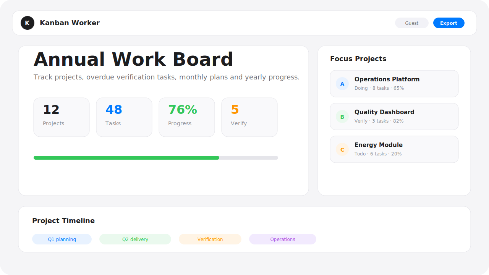
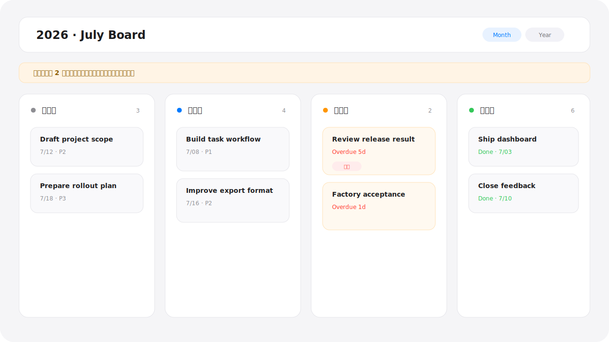
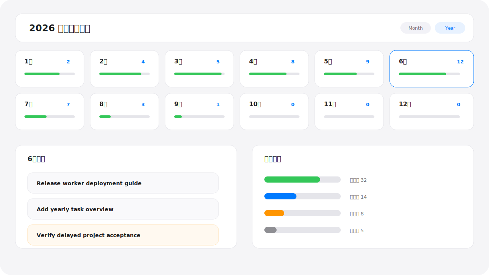

# Kanban Cloudflare Worker

一个可部署到 Cloudflare Workers + D1 + Static Assets 的轻量项目任务看板。项目适合个人工作台、小团队任务推进、年度事项跟踪和 Cloudflare 全栈部署示例。



## 特性

- 项目、任务、用户和游客只读访问
- 月看板和全年任务视图
- 任务拖拽流转：待启动、进行中、验证中、已完成
- 验证中逾期任务跨月持续显示
- 项目优先级、角色、状态和进度展示
- TXT 导出
- D1 空库自动导入 `seed-data.json`
- 开源友好的脱敏配置模板

## 界面预览

### 月度任务看板



### 全年任务视图



## 技术栈

- Cloudflare Workers
- Cloudflare D1
- Workers Static Assets
- 原生 HTML/CSS/JavaScript

## 快速开始

```powershell
npm install
Copy-Item wrangler.example.jsonc wrangler.jsonc
Copy-Item .dev.vars.example .dev.vars
npm run db:migrate:local
npm run dev
```

打开 Wrangler 输出的本地地址，通常是：

```text
http://localhost:8787
```

## Cloudflare 部署

1. 登录 Cloudflare：

```powershell
npx wrangler login
```

2. 创建 D1 数据库：

```powershell
npm run db:create
```

3. 把输出的 `database_id` 写入本地 `wrangler.jsonc`。

4. 设置生产密钥：

```powershell
npx wrangler secret put JWT_SECRET
npx wrangler secret put ADMIN_PASSWORD
```

5. 迁移并部署：

```powershell
npm run db:migrate
npm run deploy
```

完整步骤见 [docs/cloudflare-deploy.md](docs/cloudflare-deploy.md)。

## 开源配置

仓库只提交脱敏模板：

- `wrangler.example.jsonc`
- `.dev.vars.example`

本地真实文件不会提交：

- `wrangler.jsonc`
- `.dev.vars`
- `.wrangler/`
- 备份 SQL

如果历史提交中曾经包含敏感配置，开源前还需要清理 Git 历史；仅删除当前版本文件是不够的。

## 数据初始化

数据库为空时，Worker 会自动导入 `seed-data.json` 中的用户、项目和任务数据。已有数据时不会重复覆盖。

默认管理员：

```text
用户名：admin
密码：你在 ADMIN_PASSWORD 中设置的值
```

## 脚本

```powershell
npm run dev              # 本地启动 Worker
npm run deploy           # 部署 Worker 和静态资源
npm run db:create        # 创建 D1 数据库
npm run db:migrate:local # 本地 D1 迁移
npm run db:migrate       # 远端 D1 迁移
```

## 目录结构

```text
.
├── docs/
│   ├── cloudflare-deploy.md
│   └── images/
├── migrations/
├── public/
│   └── index.html
├── src/
│   └── worker.js
├── seed-data.json
├── wrangler.example.jsonc
└── .dev.vars.example
```
